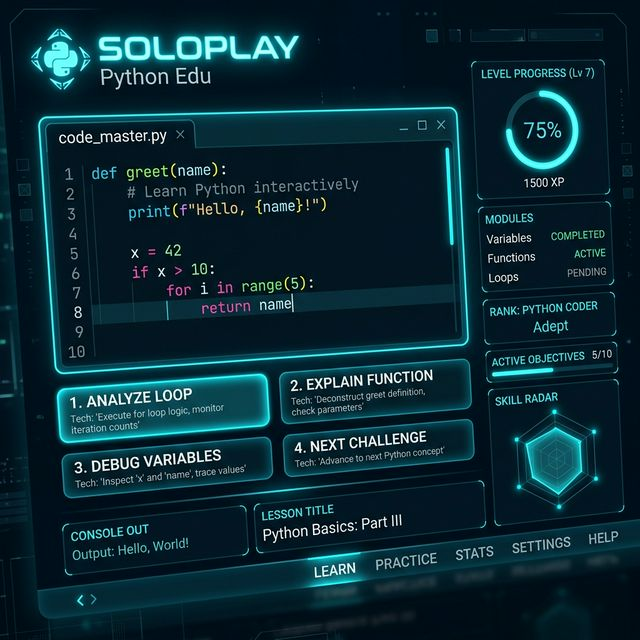

# 🐍 SOLOPLAY OS - Academia Python Adaptativa

**SOLOPLAY OS** es una aplicación web futurista diseñada para el aprendizaje autodidacta y progresivo de Python, potenciada por **Google Gemini AI** y desplegada de forma serverless. 

Ideal para perfiles técnicos (como electromecánicos o desarrolladores junior) que buscan dominar estructuras de datos y lógica de programación mediante la repetición de conceptos y retos prácticos.

## 🚀 Características Principales

*   **🤖 Generación de Retos por IA:** Utiliza el modelo `gemini-2.5-flash` para crear ejercicios personalizados basados en el nivel del usuario.
*   **📡 Integración RAG (Github del Profesor):** Los retos se inspiran automáticamente en el código real subido a repositorios de clase (Proyectos reales, Data Science, etc).
*   **🔄 Repetición Espaciada Inteligente:** La IA detecta tus puntos débiles y genera retos que te obligan a repasar conceptos previamente fallidos.
*   **🛠️ Modo Entrevista (/entrevista):** Simulador de entrevistas técnicas para roles de Data Science y Backend.
*   **👶 Modo SOS (ELI5):** Explicaciones de fallos mediante analogías simples de la vida real.
*   **🔊 Interfaz Sci-Fi Inmersiva:** Sonidos sintéticos generados por código, resaltado de sintaxis tipo VS Code y estética Neon Stealth.

## 🛠️ Stack Tecnológico

*   **Frontend:** HTML5, TailwindCSS (Vía CDN para portabilidad), Web Audio API, Chart.js, Highlight.js.
*   **Backend:** Netlify Functions (TypeScript), Netlify Blobs (Persistencia de estado).
*   **IA:** Google Generative AI (Gemini REST API).

## ⚙️ Configuración y Despliegue

Este proyecto está diseñado para ser desplegado en **Netlify** en segundos:

1.  **Clona el repo:** `git clone https://github.com/TU_USUARIO/soloplay.git`
2.  **Configura las Variables de Entorno en Netlify:**
    *   `GEMINI_API_KEY`: Tu clave de Google AI Studio.
    *   `APP_PIN`: Un código de 4 dígitos para tu acceso privado.
3.  **Despliega:** Conecta tu repo a Netlify y ¡listo!

## 📜 Créditos

Desarrollado como una herramienta de aprendizaje intensivo de Python. El sistema se alimenta del repositorio [Python-datos](https://github.com/aguscarrera77/Python-datos) para generar contexto educativo real.

---
*Desarrollado con ❤️ para dominar el código.*
